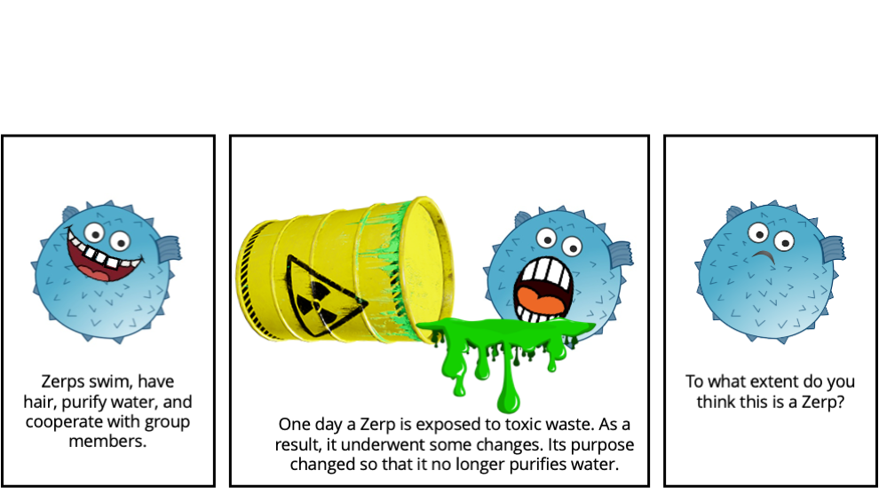

# Teleology and generics

This repository contains the experiments, data, analyses, and figures for the paper "Teleology and generics," by David Rose, Siying Zhang, Qi Han and Tobias Gerstenberg.

__Contents__:
- [Introduction](#Introduction)
- [Repository structure](#Repository-structure)

## Introduction



<br clear="left" />
<br clear="right" />

Generic statements, such as ``Bees are striped'' are thought to be a central vehicle by which essentialist beliefs are transmitted. But work on generics and essentialism almost never focuses on the type of properties that are mentioned in generic statements. We test the hypothesis that teleological properties, what something is for, affect essentialist categorization more strongly than behavioral, biological, or social properties. In Experiment 1, participants categorized properties as being either behavioral, biological, social, or teleological. In Experiment 2, we used the top four properties from each group to describe a generic noun or a specific individual. Participants then categorized creatures that had one of their properties transformed. We found that teleological properties carried more weight in categorization. In Experiment 3, we also found that teleological properties mattered more in an induction task. Taken together, our findings suggest that teleological properties play a privileged role in essentialist categorization.


## Repository structure

```
├── code
│   ├── R
│   ├── experiments
│   │   ├── experiment1
│   │   ├── ...
│   └── python
├── data
│   ├── experiment1
│   ├── experiment2
│   └── experiment3
├── docs
│   ├── experiment2
│   └── experiment3
├── figures
│   ├── experiment1
│   ├── experiment2
│   ├── experiment3
└── writeup


```

- `code/` contains all the code for the experiments, analyzing data and generating figures.
  - `experiments` contains code for each experiment that was run.
  	- `experiment1` was run in psiturk 
	- `experiment2` and `experiment3` were run in jsPsych. These are copied in `docs` below where they can be rendered in your browser.
  - `python` contains scripts that were used to get the probabilities of sentence completions for properties used in experiment 2.
  - `R` contains the analysis scripts that were used to analyze data and generate figures
     (view a rendered file [here](https://cicl-stanford.github.io/teleology_and_generics/)).
- `data/` contains anonymized data from all experiments:
  - `experiment1` contains `experiment1.db` which includes trial and demographic data. 
  - `experiment2` contains `experiment2.csv` which includes the trial data and `experiment2_demographics.csv` which includes demographic data. The remaining files are for getting the probabilities of sentence completions from large language models for the properties used in experiment 2. 
  - `experiment3` contains `experiment3.csv` which includes the trial data for experiment 3 while `experiment2_demographics.csv` contains the demographic data.
- `docs/` contains all the experiment code for `experiment2` and `experiment3`. You can preview the experiments below:
    - Experiment 2 - [Generic condition](https://cicl-stanford.github.io/teleology_and_generics/experiment2/index.html?condition=1),
      [Specific condition](https://cicl-stanford.github.io/teleology_and_generics/experiment2/index.html?condition=2)
    - Experiment 3 - [Generic condition](https://cicl-stanford.github.io/teleology_and_generics/experiment3/index.html?condition=1),
      [Specific condition](https://cicl-stanford.github.io/teleology_and_generics/experiment3/index.html?condition=2)
- `figures/` contains all the figures from the paper (generated using the script in `code/R/`). 
- `writeup/` contains the final version of the paper